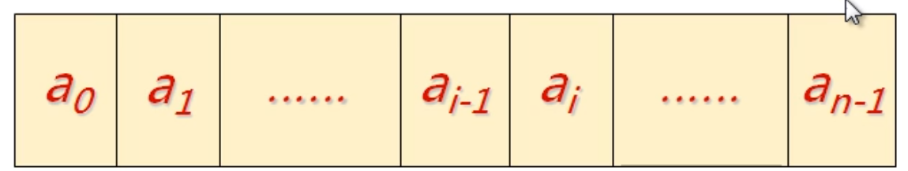
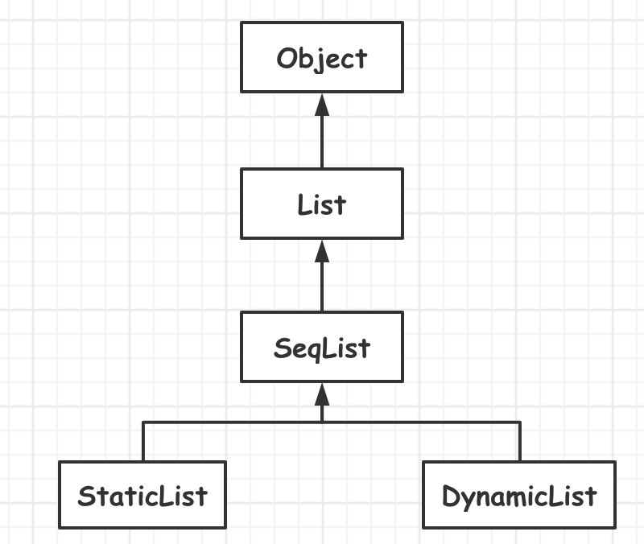
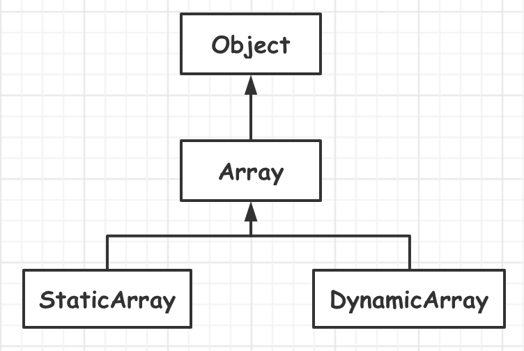

# 线性结构

<!-- GFM-TOC -->

* [线性结构](#C++工具准备)

  * [一、顺序存储]()

  * [二、数组]()

  * [三、链式存储]()

    <!-- GFM-TOC -->

---

## 一.线性表的操作

### 1.线性表的常见操作

+ 将元素插入线性表
+ 将元素从线性表中删除
+ 获取目标位置处元素的值
+ 设置目标位置处元素的值
+ 获取线性表的长度
+ 清空线性表

创建抽象类，为之后的实现做准备。

```c++
template <typename T>
class List : public Object
{
public:
    virtual bool insert(int i, const T& e) = 0;
    virtual bool remove(int i) = 0;
    virtual bool get(int i, const T& e) = 0;
    virtual bool set(int i, T& e) const = 0;
    virtual int length() const =0;
    virtual void clear() = 0;
};
```

### 2.线性表的顺序存储结构

用一段地址连续的存储单元依次存储线性表中的数据元素。



#### 设计思路：

+ 用一维数组来实现顺序存储结构
  + 存储空间：`T *m_array`
  + 当前长度：`int m_length`
+ 顺序存储结构的元素获取操作
  + 判断目标位置是否合法
  + 将目标位置作为数组下标获取元素
+ 顺序存储结构的元素的插入操作
  + 判断目标位置是否合法
  + 将插入位置之后的所有元素向后移动一个位置
  + 将新元素插入至目标位置
  + 线性表长度加1
+ 顺序存储结构的元素删除操作
  + 判断目标位置是否合法
  + 将插入位置之后的所有元素向前移动一个位置
  + 线性表长度减1

#### 抽象实现

顺序结构表的抽象实现，结构图如下所示：



其中`SeqList`是一个抽象类，只是实现了一些关键操作，但是不能生成具体的对象。因为对于顺序空间的指定，是在其子类`StaticList`和`DynamicList`中进行操作。具体设计要点如下：

+ 抽象类模板，存储空间的位置和大小由子类完成。
+ 实现顺序存储结构线性表的 **关键操作** (增,删,改,查,等)
+ 提供数组操作符，方便快速获取元素

[代码链接](https://github.com/ZYBO-o/DataStructure/blob/main/Code/DataStructure%20Realization/HeadCodes/SeqList.h)

```c++
template <typename T>
class SeqList : public List<T>
{
protected:
    T* m_array; 	//指向顺序存储空间，具体值的指定由子类完成
    int m_length;	//当前线性表的长度
public:
    bool insert(int i, const T& e);
    bool remove(int i);
    bool set(int i, const T& e);
    bool get(int i, T& e) const;
    int length() const;
    void clear();

    //顺序存储线性表的数组访问方式
    //非const对象
    T& operator [] (int i);
    //const对象
    T operator [] (int i) const;
    
  	//顺序存储空间的容量
    //之所以定义为虚函数，是因为空间的分配交给子类来完成
    virtual int capacity() const =0;
};
```

### 3.StaticList和DynamicList

#### StaticList设计要点

类模板设计：

+ 使用原生数组作为顺序存储空间，静态定义存储空间
+ 使用模板参数决定数组大小

[代码链接](https://github.com/ZYBO-o/DataStructure/blob/main/Code/DataStructure%20Realization/HeadCodes/StaticList.h)

```c++
template <typename T, int N>
class StaticList : public SeqList<T>
{
protected:
    T m_space[N]; //顺序存储空间，N为模板参数
public:
    StaticList(); //指定父类成员的具体值，将m_space[N]挂接到Seqlist中的成员变量m_array中
    int capacity( ) const;
};
```

#### DynamicList设计要点

类模板设计：

+ 申请连续堆空间作为顺序存储空间
+ 动态设置顺序存储空间的大小
+ 保证重置顺序存储空间时的异常安全性

函数异常安全的概念

+ 不泄露任何资源
+ 不允许破坏数据

[代码链接](https://github.com/ZYBO-o/DataStructure/blob/main/Code/DataStructure%20Realization/HeadCodes/DynamicList.h)

```c++
template <typename T>
class DynamicList : public SeqList<T>
{
protected:
    int m_capacity; //动态存储空间的大小
public:
    DynamicList(int capacity); //申请空间
    int capacity() const ;
    void resize(int capacity); //重新设置顺序存储空间的大小
    ~DynamicList(); //归还空间
};
```

#### 设计优化

对于容器类型的类，可以考虑禁止拷贝构造和赋值操作。

List修改为：

```c++
template <typename T>
    class List : public Object
    {
    protected:
        //进制拷贝与赋值操作
        List(const List&);
        List& operator = (const List&);
    public:
        List() {}
        //尾部插入
        virtual bool insert(const T& e) = 0;
        virtual bool insert(int i, const T& e) = 0;
        virtual bool remove(int i) = 0;
        virtual bool set(int i, const T& e) = 0;
        virtual bool get(int i, T& e) const = 0;
        virtual int length() const =0;
        virtual void clear() = 0;
    };
```

原因：

```c++
StaticList<int*,5> s1;
StaticList<int*,5> s2;

for (int k = 0; k < s1.capacity(); ++k) {
s1.insert(0,new int(k));
}

s2 = s1;

for (int m = 0; m < s1.length(); ++m) {
delete s1[m];
delete s2[k];
}
```

对于以上操作中，`s2 = s1;`会使得`s1`与`s2`都会指向同一片堆空间，所以进行`delete s2[k];`操作时，会出现错误

```c++
void func{
        DynamicList<int > d1(5);
        DynamicList<int > d2 = d1;

        for (int k = 0; k < d1.capacity(); ++k) {
            d1.insert(k,k);
            d2.insert(k,k*k);
        }

        for (int m = 0; m < d1.length(); ++m) {
            cout << d1[i] << endl;
        }
}
```

以上操作中 `DynamicList<int > d2 = d1;`会使得`d2`中的`m_array`指向`d1`中的`m_array`。所以两个插入操作其实是对一片堆空间进行操作。

最重要的是`func`函数调用结束之后，`d2`与`d1`调用的析构函数删除的是同一片堆空间，即删除两次，会产生错误。


### 4.数组类

#### 创建原因

线性表功能方面的缺陷：

+ 有可能因为惯性思维，会导致错误的使用数组操作符来进行赋值操作。
+ 在有些场合，基于顺序结构的线性表会有效率的缺陷。

所以来创建数组类弥补这些缺陷

#### 需求分析

创建数组类代替原生数组的使用

+ 包含长度信息
+ 能够主动发现越界访问

#### Array类设计要点

具体设计要点：

+ 是抽象模板类，存储空间的位置和大小由子类完成
+ 重载数组操作符，判断下标是否合法
+ 提供数组长度的抽象访问函数
+ 提供数组对象间的复制操作

```c++
template <typename T>
class Array : public Object
{
protected:
    T* m_array;
public:
    virtual bool set(int i, const T& e);
    virtual bool get(int i, T& e);

    T& operator [] (int i);
    T operator [] (int i) const;
  
    virtual int length() const = 0;

};
```


### 5.StaticArray和DynamicArray



#### StaticArray设计要点

类模板设计：

+ 封装 **原生数组**
+ 是用模板参数决定数组大小
+ 实现函数返回数组长度
+ **拷贝构造** 和 **赋值操作**

```c++
template <typename T, int N>
class StaticArray : public Array<T>
{
protected:
    T m_space[N];
public:
    StaticArray();
    StaticArray(const StaticArray<T,N>& obj);
    StaticArray<T,N>& operator = (const StaticArray<T,N>& obj);
};
```


#### DynamicArray设计要点

StaticArray的限制：

+ 创建数组类时必须明确指定数组的大小

类模板设计：

+ **动态确定** 内部数组空间的大小
+ 实现函数返回数组长度
+ **拷贝构造** 和 **赋值操作**

```c++
template <typename T>
class DynamicArray : public Array<T> {
protected:
    int m_length;
public:
    DynamicArray(int length);

    DynamicArray(const DynamicArray<T> &obj);
    DynamicArray<T> &operator=(const DynamicArray<T> &obj);

    int length() const;
    void resize(int length);

    ~DynamicArray();
};
```


