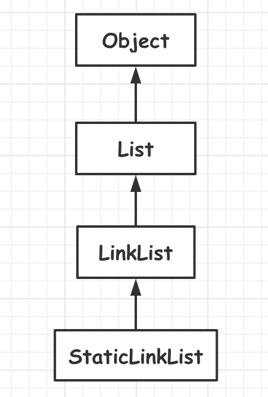

# 线性结构

<!-- GFM-TOC -->

* [线性结构](#C++工具准备)

  * [一、顺序存储结构](#一顺序存储结构)

  * [二、单链表操作](#二单链表操作)

  * [三、再论智能指针](#三再论智能指针)

  * [四、循环链表]()

  * [五、双向链表]()

  * [六、Linux内核链表]()

  * [七、双向循环链表]()

  * [八、栈]()

  * [九、队列]()

    <!-- GFM-TOC -->

---

## 线性表的操作

+ 将元素插入线性表
+ 将元素从线性表中删除
+ 获取目标位置处元素的值
+ 设置目标位置处元素的值
+ 获取线性表的长度
+ 寻找线性表元素的位置
+ 清空线性表

创建抽象类，为之后的实现做准备。

```c++
template <typename T>
class List : public Object
{
public:
    virtual bool insert(int i, const T& e) = 0;
    virtual bool remove(int i) = 0;
    virtual bool get(int i, const T& e) = 0;
    virtual bool set(int i, T& e) const = 0;
  	virtual int find(const T& e) const = 0;
    virtual int length() const =0;
    virtual void clear() = 0;
};
```

### 

---

## 一.顺序表的操作

### 1.顺序存储结构

用一段地址连续的存储单元依次存储线性表中的数据元素。


#### (1).设计思路：

+ 用一维数组来实现顺序存储结构
  + 存储空间：`T *m_array`
  + 当前长度：`int m_length`
+ 顺序存储结构的元素获取操作
  + 判断目标位置是否合法
  + 将目标位置作为数组下标获取元素
+ 顺序存储结构的元素的插入操作
  + 判断目标位置是否合法
  + 将插入位置之后的所有元素向后移动一个位置
  + 将新元素插入至目标位置
  + 线性表长度加1
+ 顺序存储结构的元素删除操作
  + 判断目标位置是否合法
  + 将插入位置之后的所有元素向前移动一个位置
  + 线性表长度减1

#### (2).抽象实现

顺序结构表的抽象实现，结构图如下所示：


其中`SeqList`是一个抽象类，只是实现了一些关键操作，但是不能生成具体的对象。因为对于顺序空间的指定，是在其子类`StaticList`和`DynamicList`中进行操作。具体设计要点如下：

+ 抽象类模板，存储空间的位置和大小由子类完成。
+ 实现顺序存储结构线性表的 **关键操作** (增,删,改,查,等)
+ 提供数组操作符，方便快速获取元素

[代码链接](https://github.com/ZYBO-o/DataStructure/blob/main/Code/DataStructure%20Realization/HeadCodes/SeqList.h)

```c++
template <typename T>
class SeqList : public List<T>
{
protected:
    T* m_array; 	//指向顺序存储空间，具体值的指定由子类完成
    int m_length;	//当前线性表的长度
public:
    bool insert(int i, const T& e);
    bool remove(int i);
    bool set(int i, const T& e);
    bool get(int i, T& e) const;
  	int find(const T& e) const;
    int length() const;
    void clear();

    //顺序存储线性表的数组访问方式
    //非const对象
    T& operator [] (int i);
    //const对象
    T operator [] (int i) const;
    
  	//顺序存储空间的容量
    //之所以定义为虚函数，是因为空间的分配交给子类来完成
    virtual int capacity() const =0;
};
```

### 2.StaticList和DynamicList

#### (1.)StaticList设计要点

类模板设计：

+ 使用原生数组作为顺序存储空间，静态定义存储空间
+ 使用模板参数决定数组大小

[代码链接](https://github.com/ZYBO-o/DataStructure/blob/main/Code/DataStructure%20Realization/HeadCodes/StaticList.h)

```c++
template <typename T, int N>
class StaticList : public SeqList<T>
{
protected:
    T m_space[N]; //顺序存储空间，N为模板参数
public:
    StaticList(); //指定父类成员的具体值，将m_space[N]挂接到Seqlist中的成员变量m_array中
    int capacity( ) const;
};
```

#### (2.)DynamicList设计要点

类模板设计：

+ 申请连续堆空间作为顺序存储空间
+ 动态设置顺序存储空间的大小
+ 保证重置顺序存储空间时的异常安全性

函数异常安全的概念

+ 不泄露任何资源
+ 不允许破坏数据

[代码链接](https://github.com/ZYBO-o/DataStructure/blob/main/Code/DataStructure%20Realization/HeadCodes/DynamicList.h)

```c++
template <typename T>
class DynamicList : public SeqList<T>
{
protected:
    int m_capacity; //动态存储空间的大小
public:
    DynamicList(int capacity); //申请空间
    int capacity() const ;
    void resize(int capacity); //重新设置顺序存储空间的大小
    ~DynamicList(); //归还空间
};
```

#### (3).设计优化

对于容器类型的类，可以考虑禁止拷贝构造和赋值操作。

List修改为：

```c++
template <typename T>
    class List : public Object
    {
    protected:
        //进制拷贝与赋值操作
        List(const List&);
        List& operator = (const List&);
    public:
        List() {}
        //尾部插入
        virtual bool insert(const T& e) = 0;
        virtual bool insert(int i, const T& e) = 0;
        virtual bool remove(int i) = 0;
        virtual bool set(int i, const T& e) = 0;
        virtual bool get(int i, T& e) const = 0;
        virtual int length() const =0;
        virtual void clear() = 0;
    };
```

原因：

```c++
StaticList<int*,5> s1;
StaticList<int*,5> s2;

for (int k = 0; k < s1.capacity(); ++k) {
s1.insert(0,new int(k));
}

s2 = s1;

for (int m = 0; m < s1.length(); ++m) {
delete s1[m];
delete s2[k];
}
```

对于以上操作中，`s2 = s1;`会使得`s1`与`s2`都会指向同一片堆空间，所以进行`delete s2[k];`操作时，会出现错误

```c++
void func{
        DynamicList<int > d1(5);
        DynamicList<int > d2 = d1;

        for (int k = 0; k < d1.capacity(); ++k) {
            d1.insert(k,k);
            d2.insert(k,k*k);
        }

        for (int m = 0; m < d1.length(); ++m) {
            cout << d1[i] << endl;
        }
}
```

以上操作中 `DynamicList<int > d2 = d1;`会使得`d2`中的`m_array`指向`d1`中的`m_array`。所以两个插入操作其实是对一片堆空间进行操作。

最重要的是`func`函数调用结束之后，`d2`与`d1`调用的析构函数删除的是同一片堆空间，即删除两次，会产生错误。

### 3.数组类

#### (1).创建原因

线性表功能方面的缺陷：

+ 有可能因为惯性思维，会导致错误的使用数组操作符来进行赋值操作。
+ 在有些场合，基于顺序结构的线性表会有效率的缺陷。

所以来创建数组类弥补这些缺陷

#### (2).需求分析

创建数组类代替原生数组的使用

+ 包含长度信息
+ 能够主动发现越界访问

#### (3).Array类设计要点

具体设计要点：

+ 是抽象模板类，存储空间的位置和大小由子类完成
+ 重载数组操作符，判断下标是否合法
+ 提供数组长度的抽象访问函数
+ 提供数组对象间的复制操作

[代码链接](https://github.com/ZYBO-o/DataStructure/blob/main/Code/DataStructure%20Realization/HeadCodes/Array.h)

```c++
template <typename T>
class Array : public Object
{
protected:
    T* m_array;
public:
    virtual bool set(int i, const T& e);
    virtual bool get(int i, T& e);

    T& operator [] (int i);
    T operator [] (int i) const;
  
    virtual int length() const = 0;

};
```

### 4.StaticArray和DynamicArray


#### (1).StaticArray设计要点

类模板设计：

+ 封装 **原生数组**
+ 是用模板参数决定数组大小
+ 实现函数返回数组长度
+ **拷贝构造** 和 **赋值操作**

[代码链接](https://github.com/ZYBO-o/DataStructure/blob/main/Code/DataStructure%20Realization/HeadCodes/StaticArray.h)

```c++
template <typename T, int N>
class StaticArray : public Array<T>
{
protected:
    T m_space[N];
public:
    StaticArray();
    StaticArray(const StaticArray<T,N>& obj);
    StaticArray<T,N>& operator = (const StaticArray<T,N>& obj);
};
```

#### (2).DynamicArray设计要点

StaticArray的限制：

+ 创建数组类时必须明确指定数组的大小

类模板设计：

+ **动态确定** 内部数组空间的大小
+ 实现函数返回数组长度
+ **拷贝构造** 和 **赋值操作**

[代码链接](https://github.com/ZYBO-o/DataStructure/blob/main/Code/DataStructure%20Realization/HeadCodes/DynamicArray.h)

```c++
template <typename T>
class DynamicArray : public Array<T> {
protected:
    int m_length;
public:
    DynamicArray(int length);

    DynamicArray(const DynamicArray<T> &obj);
    DynamicArray<T> &operator=(const DynamicArray<T> &obj);

    int length() const;
    void resize(int length);

    ~DynamicArray();
};
```

#### 代码优化

因为成员函数中有很多重复逻辑的代码，所以可以进行优化。

+ `init`函数
  + 对象构造时的初始化操作

```c++
void init(T* array, int length)
{
    if(array != nullptr)
    {
        this->m_array = array;
        this->m_length = length;
    } else {
        THROW_EXCEPTION(NoEnoughMemoryException, "No memory to init DynamicArray object...");
    }
}
```

+ `copy`函数
  + 在堆空间中申请新的内存，并执行拷贝操作

```c++
T* copy(T* array, int len, int newLen)
{
    T* ret = new T[newLen];

    if (ret != nullptr){
        int size = (len < newLen ? len : newLen);

        for (int i = 0; i < size; ++i) {
            ret[i] = array[i];
        }
    }
    return ret;
}
```

+ `update`函数
  + 将指定的堆空间作为内部存储数组使用

```c++
void update(T* array, int length)
{
    if(array != nullptr)
    {
        T* temp = this->m_array;

        this->m_array = array;
        this->m_length = length;

        delete [] temp;
    } else {
        THROW_EXCEPTION(NullPointerException,"This is a nullptr...");
    }
}
```

---

## 二.单链表的操作

### 1.链式存储结构

为了表示每个数据元素与其后继元素之间的逻辑关系；数据元素除了存储本身的信息之外，还需要存储其直接后继的信息。


#### (1).设计思路

基于链式存储结构的线性表中，每个结点都包含数据域和指针域。

+ 数据域：存储数据本身
+ 指针域：存储相邻结点的地址

#### (2).基本概念

链表中的基本概念：

+ **头结点**
  + 链表中的辅助结点，只包含指向第一个数据元素的指针
+ **数据结点**
  + 链表中代表数据元素的结点，表现形式为：(数据元素，地址)
+ **尾结点**
  + 链表中的最后一个数据结点，包含的地址信息为空

链表的基本操作：

+ **在目标位置处插入数据元素**

  + 从头节点开始，通过`current`指针定位到目标位置
  + 从堆空间中申请新的`Node`结点
  + 执行插入操作

  

+ **在目标位置处删除数据元素**

  + 从头节点开始，通过`current`指针定位到目标位置
  + 使用`toDel`指针指向需要删除的节点
  + 执行删除操作

  


#### (3).具体实现

LinkList设计要点：

+ 类模板，**通过头结点访问后继元素**
+ 定义内部结点Node，用于描述数据域和指针域
+ 实现线性表的 **关键操作** (增，删，查，等)

[代码链接](https://github.com/ZYBO-o/DataStructure/blob/main/Code/DataStructure%20Realization/HeadCodes/LinkList.h)

```c++
template <typename T>
class LinkList : public List<T>
{
protected:
    struct Node : public Object
    {
        T value;
        Node* next;
    };
    //防止创建头结点的时候调用构造函数
    mutable struct : public Object {
        char reserved[sizeof(T)];
        Node* next;
    } m_header;
    int m_length;
public:
    LinkList();

    bool insert(const T& e);
    bool insert(int i, const T& e);
    bool remove(int i);
    bool set(int i, const T& e);
    bool get(int i) const;
    bool get(int i, T& e) const;
    int length() const;
    void clear();
    ~LinkList();
};
```


### 2.单链表的遍历和优化

#### (1).设计思路

+ 在单链表的内部定义一个**游标** (Node *m_current)
+ 遍历开始前将游标指向位置为0的数据元素
+ 获取游标指向的数据元素
+ 通过结点中的`next`指针移动游标

提供一组遍历相关的函数，以线性的时间复杂度遍历链表。

| 函数      | 功能说明                    |
| --------- | --------------------------- |
| move()    | 将游标定位到目标位置        |
| next()    | 移动游标                    |
| current() | 获取游标指向的数据元素      |
| end()     | 游标是否到达尾部 (是否为空) |

#### (2).实现目标

+ 单链表的遍历在线性时间内完成
+ 在单链表内部定义游标变量，通过游标变量提高效率
+ 遍历相关的成员函数时相互依赖，相互配合的关系
+ 封装结点的申请和删除操作更有利于增强扩展性

#### (3).具体实现

类变量修改与添加：

```c++
template <typename T>
class LinkList : public List<T>
{
protected:
    struct Node : public Object
    {
        T value;
        Node* next;
    };

    //防止创建头结点的时候调用构造函数
    mutable struct : public Object {
        char reserved[sizeof(T)];
        Node* next;
    } m_header;


    int m_length;

    //添加有关游标
    Node* m_current;
    //游标每次移动的数目
    int m_step;

    //定位函数
    Node* position (int i) const
    {
        Node* current = reinterpret_cast<Node*>(&m_header);

        for (int j = 0; j < i; ++j) {
            current = current->next;
        }

        return current;
    }

    //进行进一步封装
    virtual Node* create()
    {
        return new Node();
    }

    virtual void destory(Node* pn)
    {
        delete pn;
    }
public:
  ...
};
```

函数实现：

```c++
//将游标定位到目标位置
bool move(int i, int step = 1)
{
    bool ret = (0 <= i) && (i < m_length) && (step > 0);
    if(ret)
    {
        m_current = position(i)->next;
        m_step = step;
    }
    return ret;
}

//游标是否到达尾部 (是否为空)
bool end()
{
    return (m_current == nullptr);
}

//获取游标指向的数据元素
T current()
{
    if(!end())
    {
        return m_current->value;
    } else {
        THROW_EXCEPTION(InvalidOperationException,"No value at current position ...");
    }
}

//移动游标
bool next()
{
    int i = 0;
    while( (i < m_step) && !end())
    {
        m_current = m_current->next;
        i++;
    }
    return (i == m_step);
}
```

### 3.静态链表

#### (1).单链表的缺陷

+ **触发条件：**
  + 长时间使用单链表对象频繁增加和删除数据元素
+ **可能的结果：**
  + 堆空间产生大量的内存碎片，导致系统运行缓慢

#### (2).设计思路

在"单链表"的内部增加一片预留的空间，所有的`Node`对象都在这片空间中动态创建和动态销毁。



所以只需要修改`create`和`destory`这两个函数就行了。

#### (3).具体实现

静态链表的实现思路：

+ 通过模板定义静态单链表类
+ 在类中定义固定大小的空间
+ 重写`create`和`destory`函数，**改变内存的分配和归还方式**
+ 在`Node`类中重载`operation new`，用于在指定内存上创建对象

[代码链接](https://github.com/ZYBO-o/DataStructure/blob/main/Code/DataStructure%20Realization/HeadCodes/StaticLinkList.h)

```c++

template <typename T, int N>
class StaticLinkList : public LinkList<T>
{
protected:
    typedef typename LinkList<T>::Node Node;
    struct SNode : public Node
    {
        void* operator new (unsigned long size, void* loc)
        {
            (void)size;
            return loc;
        }
    };
    unsigned char m_space[sizeof(SNode) *N];
    int m_used[N];

    Node* create()
    {
        SNode* ret = nullptr;

        for (int i = 0; i < N; ++i) {
            if( !m_used[i])
            {
                ret = reinterpret_cast<SNode*>(m_space) + i;
                ret = new(ret)SNode();
                m_used[i] = 1;
                break;
            }
        }
        return ret;
    }

    void destroy(Node* pn)
    {
        SNode* space = reinterpret_cast<SNode*>(m_space);
        SNode* psn = dynamic_cast<SNode*>(pn);

        for (int i = 0; i < N; ++i) {
            if(psn == (space + i))
            {
                m_used[i] = 0;
                psn->~SNode();
                break;
            }
        }
    }
public:
    StaticLinkList();
    int capacity();
    ~StaticLinkList();
};
```


---

## 三.再论智能指针

### 1.替代原生指针

#### (1).问题所在

使用智能指针代替单链表中的原生指针的问题：

SmartPointer设计方案中有：**<font color = red>一片堆空间最多只能由一个指针标识。</font>**但是遍历时有多个指针指向堆空间，与设计相悖，所以需要重新设计。

### 2.重新设计

#### (1).新的设计方案


`Pointer`是`Object`的直接子类，也是两个智能指针的父类。

`SharePointer`支持多个指针指向同一片堆空间，也支持自动释放堆空间。

#### (2).Pointer设计

`Pointer`是智能指针的抽象父类(模板)

+ 纯虚函数`virtual ~Pointer() = 0`
+ 重载`operation -> ()`
+ 重载`operation * ()`

[代码链接](https://github.com/ZYBO-o/DataStructure/blob/main/Code/DataStructure%20Realization/HeadCodes/SmartPointer/Pointer.h)

```c++
template <typename T>
class Pointer : public Object
{
protected:
    T* m_pointer;
public:
    Pointer(T* p = nullptr);
    T* operator -> ();
    T& operator * ();
    bool IsNull();
    T* get();
};
```

#### (3).SmartPointer修改

[代码链接](https://github.com/ZYBO-o/DataStructure/blob/main/Code/DataStructure%20Realization/HeadCodes/SmartPointer/SmartPointer.h)

```c++
template <typename T>
class SmartPointer : public Pointer<T>
{
public:
    //构造函数
    SmartPointer(T * p = nullptr) : Pointer<T>(p);
    //拷贝函数
    SmartPointer(const SmartPointer<T>& obj);
    //重载 = 运算符
    SmartPointer<T>& operator = (const SmartPointer<T>& obj);
    ~SmartPointer();
```

### 3.sharedPointer设计

#### (1).设计要点

`SharedPointer`设计要点：

+ 也是类模板

  + 通过 **计数机制(ref)** 标识堆内存
    +  堆内存被指向时：`ref++`
    + 指针被置空时：`ref--`
    + `ref == 0`时，释放堆内存

+ 计数机制原理：

  

  + 堆空间中每一个对象都有一个计数变量相关联，计数变量也是在堆空间创建的，与堆空间的生命周期也相同
  + 计数变量表示指向的指针数目

+ 由于`SharedPointer`支持多个对象同时指向一篇堆内存，所以 **必须支持比较操作**

#### (2).具体实现

[代码链接](https://github.com/ZYBO-o/DataStructure/blob/main/Code/DataStructure%20Realization/HeadCodes/SmartPointer/SharedPointer.h)

```c++
template <typename T>
class SharedPointer :  public Pointer<T>
{
protected:
  	//计数机制成员指针
    int* m_ref;

public:
    SharedPointer(T* p = nullptr);
    SharedPointer(const  SharedPointer<T>&  obj);
    SharedPointer<T>& operator = (const SharedPointer<T>&  obj);
  	//将当前指针置为空
    void clear();
    ~SharedPointer();
};
```


### 3.注意事项

使用智能指针的注意事项：

+ 只能用指向堆空间中的单个变量(对象)
+ 不同类型的智能指针对象不能 **混合使用**
+ 不能使用`delete`释放智能指针指向的堆空间


---

## 四.


---


