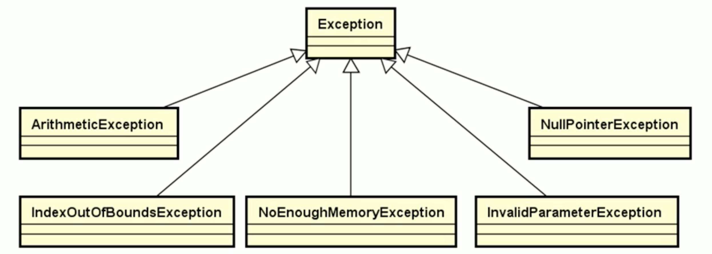
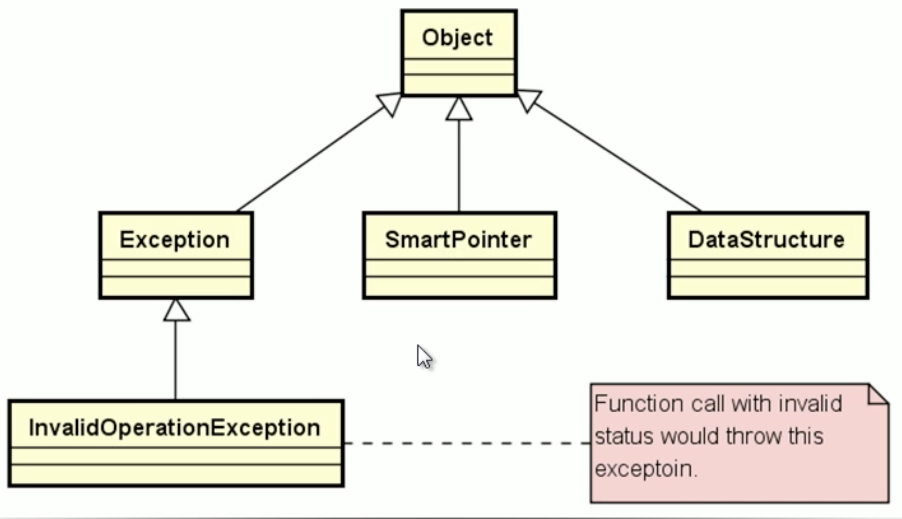

# C++工具准备

<!-- GFM-TOC -->

* [C++ 工具准备](#C++工具准备)

  * [一、智能指针类](#一智能指针类)

  * [二、异常类](#二异常类)

  * [三、顶层父类](#三顶层父类)

    <!-- GFM-TOC -->

---

## 一.智能指针类

### 1.问题的出现

**内存泄漏**是一个出现后很难查找的问题，出现原因主要有：

+ 动态申请内存，**用完后不归还**
+ C++语言中**没有垃圾回收机制**
+ 指针**无法控制**指向堆空间的生命周期——**<font color = red>最本质的问题</font>**

### 2.问题解决的思路

> 如果能够使指针在生命周期结束的时候自动归还堆空间，那就能解决一半的问题了

C++软件平台提供了**智能指针**：

+ 指针在生命周期结束时**主动释放堆空间**
+ 一片堆空间**最多只能由一个指针标识**
+ **杜绝**指针运算与指针比较

### 3.智能指针的设计思路

+ **通过类模板描述指针的行为**

  > 能够定义不同类型的指针对象

+ **重载指针特征操作符( * ,  ->)**

  > 利用对象模拟原生指针行为

### 4.主要实现

[代码链接](https://github.com/ZYBO-o/DataStructure/blob/main/Code/DataStructure%20Realization/HeadCodes/SmartPointer.h)

```c++
template <typename T>
class SmartPointer
{
protected:
    T* m_pointer;
public:
    //构造函数:默认情况下指针为空 ——> 疑问：为什么不能直接用SmartPointer(){m_pointer = nullpter}?
    SmartPointer(T* p = nullptr)
    {
        m_pointer = p;
    }

    //拷贝函数
    SmartPointer(const SmartPointer<T>& obj)
    {
        m_pointer = obj.m_pointer;
        const_cast<SmartPointer<T>&>(obj).m_pointer = nullptr;
    }

    //重载 = 运算符，将赋值后obj的指针删除，使得只有m_pointer指向堆空间
    SmartPointer<T>& operator = (const SmartPointer<T>& obj);

    //重载 * 运算符
    T& operator * ();

    //重载 -> 运算符
    T* operator -> ();

    //查看是否为空
    bool IsNull();

  	//获取指针
    T* get();
  	//析构函数
  	~SmartPointer()
    {
      	delete m_pointer;
    }
```

### 5.分析

+ 通过定义在析构函数中释放指针，满足了 **指针在生命周期结束时主动释放堆空间** 的目标
+ 通过 `=` 重载运算符的构建，满足了 **一片堆空间最多只能由一个指针标识** 的目标
+ 因为没有构建 `++` 重载运算符，满足了 **杜绝指针运算与指针比较** 的目标

---

## 二.异常类

### 1.问题的出现

在早些时期，C++ 本身并没有处理运行期错误的能力。取而代之的是那些传统的 C 的异常处理方法。这些方法可以被归为三类设计策略：

+ 函数返回一个状态码来表明成功或失败；
+ 把错误码赋值给一个全局标记并且让其他的函数来检测；
+ 终止整个程序；

上述的任何一个方法在面向对象环境下都有明显的缺点和限制，如繁琐的检测函数返回值和全局的错误码，程序崩溃等。其中的一些根本就不可接受，尤其是在大型应用程序中。因此C++的异常处理就在这个背景下产生的。C++自身有着非常强的纠错能力，发展到如今，已经建立了比较完善的异常处理机制。

### 2.解决问题的思路

C++ 之父 Bjarne Stroustrup说：提供异常的基本目的就是为了处理上面的问题。基本思想是：让一个函数在发现了自己无法处理的错误时抛出(throw)一个异常，然后它的(直接或者间接) 调用者能够处理这个问题。

C++ 内置了异常处理的语法元素 `try...catch...`

+ `try`语句处理正常代码逻辑
+ `catch`语句处理异常情况
+ `try`语句中的异常由对应的`catch`语句处理

### 3.以除法运算为例进行简单介绍

> 当除数为0的时候会产生错误，所以需要进行异常处理

```c++
double divide(double a, double b)
{
    //因为浮点数的表述是不精确的，所以最好不要通过等号的方式进行比较
    const double delta = 0.000000000000001;
    double ret = 0;
    if (!((-delta < b) && (delta > b))) {
        ret = a / b;
    } else {
        throw 0; //产生除0异常
    }
    return ret;
}

int main() {
    try{
        divide( 1.0 , 0);
    }catch (int) {
        cout << "divided 0" <<endl;
    }
    return 0;
}
```

`throw`抛出的异常必须被`catch`处理

+ 当前函数能够处理异常，程序继续往下执行
+ 当前函数无法处理异常，则函数停止执行，并返回。
  + **未被处理的异常会顺着函数调用栈向上传播，直到被处理为止，否则程序将停止执行**。

同一个`try`语句可以跟上多个`catch`语句

+ `catch`语句可以定义具体处理的异常类型
+ 不同类型的异常由不同的`catch`语句负责处理
+ `try`语句可以抛出任何类型的异常
+ `catch(...)`用于处理所有类型的异常
+ 任何异常都只能被捕获(`catch`)一次。

### 3.异常类的构建

#### 注意事项

+ 异常的类型可以是自定义类类型
+ 赋值兼容性原则在异常匹配中依旧适用
+ 对于类类型异常的匹配依旧是自上而下严格匹配
  + 匹配子类异常的`catch`放在上面
  + 匹配父类异常的`catch`放在下面

#### 结构设计



异常类的设计结构如上图所示，`Exception`是抽象父类，主要是被继承，主要为五个异常类型：

+ `NullPointerException`：空指针异常
+ `ArithmeticException`：计算异常
+ `IndexOutOfBoundsException`：越界异常
+ `NoEnoughMemoryException`：内存不足异常
+ `InvaildParameterException`：无效参数异常

#### 抽象父类的设计

[代码链接](https://github.com/ZYBO-o/DataStructure/blob/main/Code/DataStructure%20Realization/HeadCodes/Exception.h)

> 定义与声明在`Exception.h`，实现在`Exception.cpp`

```c++
class Exception {
protected:
    //变量m_message表示异常的具体信息
    char* m_message;
    //变量m_location表示异常的定位
    char* m_location;
    //定义辅助函数进行初始化，
    //因为下面三个构造函数的内部逻辑是相似的，所以可以借用辅助函数来进行初始化的操作
    void init(const char *message, const char *file, int line);

  public:
    Exception(const char *message);
    Exception(const char *file, int line);
    Exception(const char *message, const char *file, int line);
    Exception(const Exception &e);
    Exception &operator=(const Exception &e);
    //message函数得到异常的信息
    virtual const char* message() const;
    //location函数得到异常的定位
    virtual const char* location() const;
    //纯虚析构函数——抽象类
    virtual ~Exception() = 0;
};
```

---

## 三.顶层父类

### 1.定义顶层父类的原因

**当代软件架构实践中的经验**

+ 尽量使用 **单继承** 的方式进行系统设计
+ 尽量保持系统中只存在 **单一的继承树**
+ 尽量使用 **组合关系** 代替继承关系

以上经验通常是利用顶层父类的创建来进行保证。

**创建`DataStructure::Object`类的意义：**

+ 遵循经典设计准则，所有数据结构都继承自`Object`类
+ 定义动态申请内存的行为，提高代码的移植性

> 编译器不同时，对于`new`操作失败后的反馈也不同，利用编写顶层父类来重载操作，可以提高代码的移植性。

### 2.顶层父类的设计

 * Object类是DataStructure中数据结构类的顶层父类
 * Object类是统一动态内存申请的行为
 * Object类为纯虚父类，所有子类都能进行动态类型识别

对数据结构对象进行 `new` 和 `delete` 操作时，能有我们期望的行为，而且这个行为在不同的编译器中都是相同的结果。

[代码链接](https://github.com/ZYBO-o/DataStructure/blob/main/Code/DataStructure%20Realization/HeadCodes/Object.h)

> 定义与声明在`Object.h`，实现在`Object.cpp`

```c++
class Object
{
public:
  	//异常规格说明在new操作失败时，不会抛出异常，而是返回空指针
    void* operator new (unsigned long size) throw();
    void operator delete (void* p);
    void* operator new[] (unsigned long size) throw();
    void operator delete[] (void* p);
  	//抽象类，保证所有子类中都有虚函数表的指针，这样就能使用动态类型相关的技术
    virtual ~Object() = 0;
};
```

### 3.类族结构的进化

DataStructure中所有类都位于单一的继承树：



改进的关键点：

+ `Exception`类继承自`Object`类
  + 堆空间中创建异常对象失败时，返回`nullptr`指针
+ 新增`InvalidOperationException`异常类
  + 成员函数调用时，如果状态不正确，则抛出异常
+ `SmartPointer`类继承自`Object`类
  + 堆空间中创建智能指针对象失败时，返回`nullptr`指针

