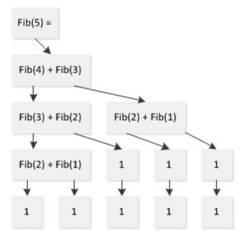

# 递归操作

<!-- GFM-TOC -->

* [浅谈递归]()
  + [1.递归的思想]()
  + [2.递归需要满足的两个条件]()
  + [3.递归的效率问题]()
* [递归例题]()

<!-- GFM-TOC -->

---

## 一.浅谈递归

### 1.递归的思想

递归的数学模型其实就是归纳法。[归纳法](http://www.nowamagic.net/librarys/veda/tag/归纳法)适用于想解决一个问题转化为解决他的子问题，而他的子问题又变成子问题的子问题，而且我们发现这些问题其实都是一个模型，也就是说存在相同的逻辑归纳处理项。当然有一个是例外的，也就是递归结束的哪一个处理方法不适用于我们的归纳处理项，当然也不能适用，否则我们就无穷递归了。这里又引出了一个归纳终结点以及直接求解的表达式。如果运用列表来形容归纳法就是：

- 步进表达式：问题蜕变成子问题的表达式
- 结束条件：什么时候可以不再是用步进表达式
- 直接求解表达式：在结束条件下能够直接计算返回值的表达式
- 逻辑归纳项：适用于一切非适用于结束条件的子问题的处理，当然上面的步进表达式其实就是包含在这里面了。

这样其实就结束了，递归也就出来了。递归算法的一般形式：

```c++
void func( mode)
{
    if(endCondition)
    {
        constExpression         //基本项
    }
    else
    {
        accumrateExpreesion     //归纳项
        mode=expression         //步进表达式
            func(mode)          //调用本身，递归
    }
}
```

对于递归，最好的理解方式便是从函数的功能意义的层面来理解。了解一个问题如何被分解为它的子问题，这样对于递归函数代码也就理解了。

**<font color = red>这里有一个误区（我也曾深陷其中），就是通过分析堆栈，分析一个一个函数的调用过程、输出结果来分析递归的算法。这是十分要不得的，这样只会把自己弄晕，其实递归本质上也是函数的调用，调用的函数是自己或者不是自己其实没什么区别。</font>**在函数调用时总会把一些临时信息保存到堆栈，堆栈只是为了函数能正确的返回，仅此而已。我们只要知道递归会导致大量的函数调用，大量的堆栈操作就可以了。

> 引用自博客[《漫谈递归：递归的思想》](http://www.nowamagic.net/librarys/veda/detail/2314)

### 2.递归需要满足的两个条件

递归，并不是简单的“自己调用自己”，也不是简单的“交互调用”。 **它是一种分析和解决问题的方法和思想。** 简单来说，递归的思想就是： **把问题分解成为规模更小的、具有与原问题有着相同解法的问题。** 比如二分查找算法，就是不断地把问题的规模变小（变成原问题的一半），而新问题与原问题有着相同的解法。

有些问题使用传统的迭代算法是很难求解甚至无解的，而使用递归却可以很容易的解决。比如汉诺塔问题。但递归的使用也是有它的劣势的，因为它要进行多层函数调用，所以会消耗很多堆栈空间和函数调用时间。

既然递归的思想是把问题分解成为规模更小且与原问题有着相同解法的问题，那么是不是这样的问题都能用递归来解决呢？答案是否定的。并不是所有问题都能用递归来解决。那么什么样的问题可以用递归来解决呢？一般来讲，能用递归来解决的问题必须满足两个条件：

- **<font color = red>可以通过递归调用来缩小问题规模，且新问题与原问题有着相同的形式。</font>**
- **<font color = red>存在一种简单情境，可以使递归在简单情境下退出。</font>**

**在编写递归调用的函数的时候，一定要把对简单情境的判断写在最前面，以保证函数调用在检查到简单情境的时候能够及时地中止递归，否则，你的函数可能会永不停息的在那里递归调用了。**

> 引用自博客[《漫谈递归：递归需要满足的两个条件》](http://www.nowamagic.net/librarys/veda/detail/2315)

### 3.递归的效率问题

递归在解决某些问题的时候使得我们思考的方式得以简化，代码也更加精炼，容易阅读；但它的效率问题也很大。

是拿斐波那契（Fibonacci）数列来做例子。在很多教科书或文章中涉及到递归或计算复杂性的地方都会将计算斐波那契数列的程序作为经典示例。

```c++
ulong Fib(ulong n)
{
    return (n == 1 || n == 2) ? 1 : Fib(n - 1) + Fib(n - 2);
}
```

看来好看的代码未必中用，如果程序在效率不能接受那美观神马的就都是浮云了。如果简单分析一下程序的执行流，就会发现问题在哪，以计算Fibonacci(5)为例：



从上图可以看出，在计算Fib(5)的过程中，Fib(1)计算了两次、Fib(2)计算了3次，Fib(3)计算了两次，本来只需要5次计算就可以完成的任务却计算了9次。这个问题随着规模的增加会愈发凸显，以至于Fib(1000)已经无法再可接受的时间内算出。

由以上分析我们可以看到，递归在处理问题时要反复调用函数，这增大了它的空间和时间开销，所以在使用迭代可以很容易解决的问题中，使用递归虽然可以简化思维过程，但效率上并不合算。效率和[开销](http://www.nowamagic.net/librarys/veda/tag/开销)问题是递归最大的缺点。

虽然有这样的缺点，但是递归的力量仍然是巨大而不可忽视的，因为有些问题使用迭代算法是很难甚至无法解决的（比如汉诺塔问题）。这时递归的作用就显示出来了。


## 二.递归例题


