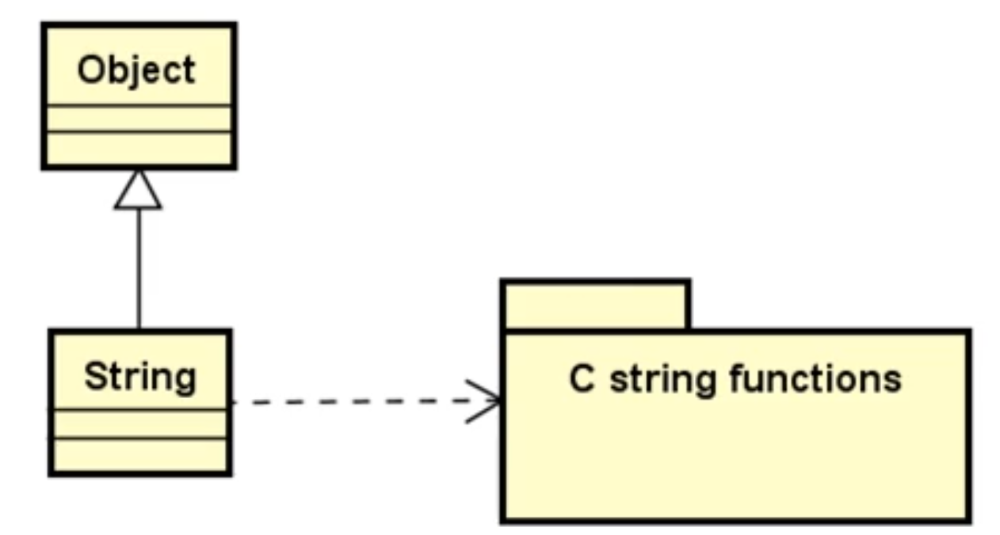
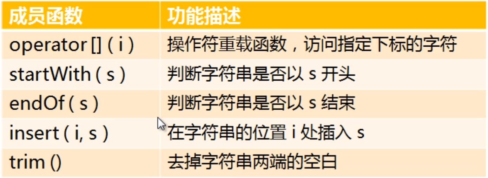
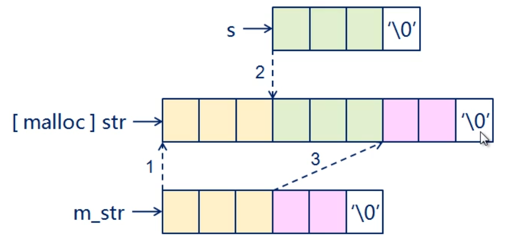
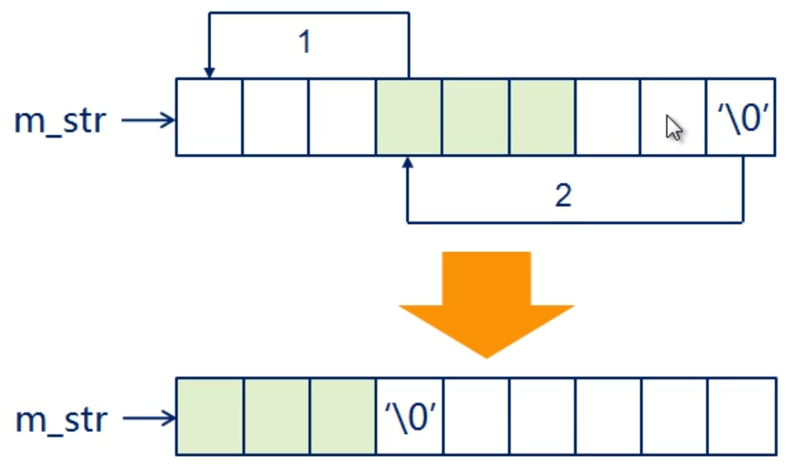
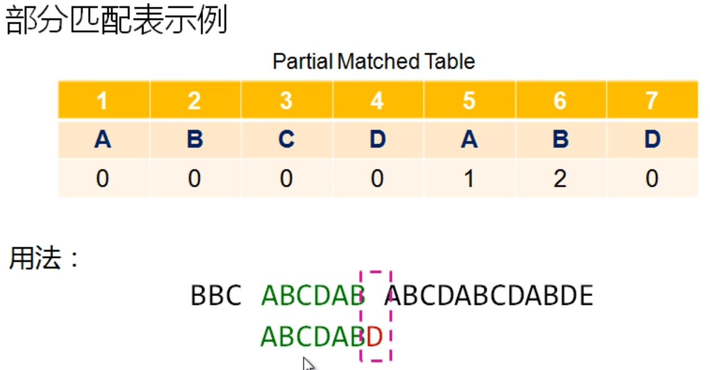
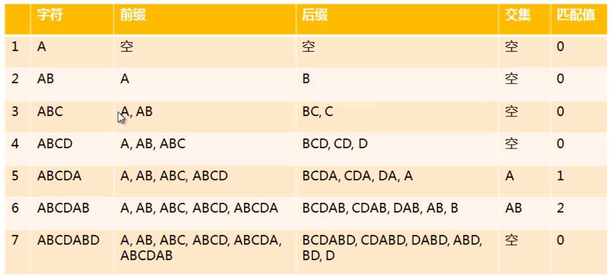
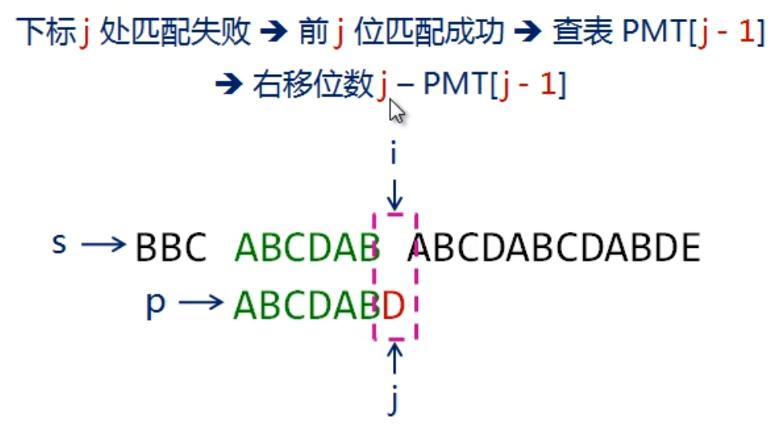
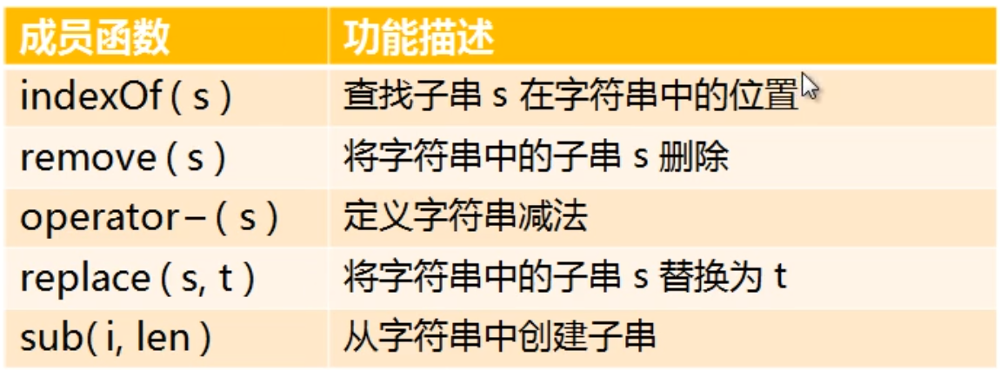

# 字符串

<!-- GFM-TOC -->

* [字符串类的创建](#C++工具准备)

  <!-- GFM-TOC -->

---

## 一.字符串类的创建

### 1.历史遗留问题

+ C语言不支持真正意义上的字符串
+ C用 **字符数组** 和 **一组函数(strlen,strcmp..)** 实现字符串操作
+ C不支持自定义类型， **无法获得字符串类型**

### 2.C++ 中的字符串类

+ C到C++的进化引入了自定义类型
+ 在C++中可以 **通过类完成字符串类型的定义**
+ C++原生类型系统通过库来包含字符串类，如STL中的string 

 ### 3.字符串类的设计

+ 继承自Object顶层父类
+ 依赖于C语言函数包



> 实现时需要注意的事项：
>
> + 无缝实现String对象与char * 字符串的互操作
> + 操作符重载函数需要考虑是否支持const版本
> + 通过C语言中的字符串函数实现String的成员函数
>
> 用C++面向对象技术对C语言字符串相关函数进行封装

---

## 二.字符串类的实现

### 1.字符串的创建


### 2.字符串常用成员函数



#### (1).重载[]操作符

+ 重载数组访问操作符[]
  + 无const修饰对象：`char& operator[](int i )`；
  + const修饰对象：`char operator[](int i) const`;

+ 注意事项

  + 当i的取值不合法时，抛出异常

    > 合法范围 (0 <= i) && (i < m_length)

#### (2).判断字符串开头与结尾

+ 判断字符串是否以s开头
  + C字符串:`bool startWith(const char* s) const`；
  + String对象:`bool startWith(const String& s) const`；

+ 判断字符串是否以s结尾
  + C字符串:`bool endOf(const char* s) const`；
  + String对象:`bool endOf(const String& s) const`；

#### (3).插入操作

+ 在指定位置处插入字符串

  + C字符串：`String& insert(int i, const char* s)`；
  + String对象：`String& insert(int i, const String& s)`;

  

#### (4).去空格操作

+ 去掉字符串两端的空格。
  + 函数声明：`String& trim()`;



---

## 三.KMP算法

### 1.基本原理

+ **匹配失败时的右移位数与子串本身相关，与目标串无关**
+ **<font color = red>移动位数</font> = 已匹配的字符数 - 对应的部分匹配值**
+ **任意子串都存在一个唯一的部分匹配表**

### 2.实例



第7位匹配失败——>前6位匹配成功——>查表PMT[6]——>右移位数6 - PMT[6] = 6 - 2 = 4

### 3.部分匹配值

#### (1).基本概念

+ **前缀：**
  + 除了最后一个字符以外，一个字符串的所有全部头部组合
+ **后缀：**
  + 除了第一个字符以外，一个字符串的全部尾部组合
+ **部分匹配值：**
  + 前缀和后缀最长公共元素的长度。

#### (2).实例：ABCDABD



#### (3).程序表达：

+ **实现关键：**
  + PMT[0] = 0;
  + 从2个字符开始递推(下标为1)
  + 假设 PMT[n] = PMT[n-1] + 1 (最长共有元素的长度)
  + 当假设不成立，PMT[n]在PMT[n-1]的基础上减少

+ **代码实现：**

  ```c++
  int* make_pmt(const char* p) {
      int len = strlen(p);
      int* ret = new int (len);
  
      if(ret != nullptr) {
          int ll = 0;
          ret[0] = 0;
  
          for (int i = 1; i < len; ++i) {
              //非理想情况,假设不成立
              while(ll > 0 && p[ll] != p[i]) {
                  ll = ret[ll - 1];
              }
              //推导成立的情况
              if(p[ll] == p[i]) {
                  ++ ll;
              }
              ret[i] = ll;
          }
      }
      return ret;
  }
  ```

### 4.部分匹配表的使用(KMP算法)

#### (1).实例



+ 因为 s[i] != p[j]
+ 所以查表， LL = PMT[j-1]
+ 于是，右移，i的值不变，j 的值改变，j = j - (j - LL) = LL = PMT[j - 1]

#### (2).代码实现

```c++
int KMP(const char* s, const char* p) {
    int ret = -1;
    int sl = strlen(s);
    int pl = strlen(p);
    int* pmt = make_pmt(p);

    if((pmt != nullptr) && (0 < pl) && (pl <= sl)) {
        for (int i = 0, j = 0; i < sl; ++i) {
            //匹配不成功
            while( j > 0 && s[i] != p[j]) {
                j = pmt[j - 1];
            }

            if(s[i] == p[j]) {
                ++j;
            }

            if(j == pl) {
                ret = i + 1 - pl;
                break;
            }
        }
    }
    free(pmt);
    return ret;
}
```

---

## 四.字符串类的拓展

### 1.字符串类的拓展函数



### 2.拓展函数的实现

#### (1).子串查找操作

+ C字符串：`int indexOf(const char* s) const`;
+ String 对象：`int indexOf(const String& s) const`;

利用KMP实现。

#### (2).字符串删除操作

+ C字符串：`String& remove(const char* s)`;
+ String 对象：`String& remove(const String& s)`;

+ 根据KMP在目标字符串进行查找子串的位置
+ 通过子串位置和子串长度进行删除

#### (3).字符串减法操作

+ 使用remove 实现字符串间的减法操作
  + 字符串本身不被修改
  + 返回产生的新串

#### (4).字符串替换子串操作

+ `String& replace (const char* t, const char* s)`;
+ `String& replace (const String& t, const char* s)`;
+ `String& replace (const char* t, const String& s)`;
+ `String& replace (const String& t, const String& s)`;

#### (5).创建子串函数

+ `String sub(int i, int len) const`;
  + 以i为起点提取长度为 len 的长度
  + 子串提取不会改变字符串本身的状态


