# 树结构

<!-- GFM-TOC -->

* [字符串类的创建](#C++工具准备)

<!-- GFM-TOC -->

## 一.树的定义与操作

### 1.树的定义

+ 树是一种非线性的数据结构
+ **树是由 <font color = red>n(n >= 0)</font> 个结点组成的有限集合**
  + 如果 **<font color = red>n = 0</font>** ,称为空树
  + 如果 **<font color = red>n > 0</font>** ,则：
    + 有一个特定的称之为 **<font color = red>根(root)</font>** 的结点
    + 根节点只有直接后继，但没有直接前驱
    + 除根以外的其他结点划分为 **<font color = red>m(m>=0)</font>** 个互不相交的有限集合 **<font color = red>T0,T1,...,Tm-1</font>** ,每个集合又是一棵树，并且称之为根的 **<font color = red>子树</font>** 。

+ **树中度的概念**
  + 树的结点包含一个数据及若干指向子树的分支
  + 结点拥有的子树数目称为 **结点的度**
    + 度为 0 的结点称为叶结点
    + 度不为 0 的结点称为分支结点
  + 树的度定义为所有结点中度的最大值
+ **树中的前驱与后继**
  + 结点的直接后继称为该结点的孩子，该结点为孩子的双亲
  + 结点的孩子的孩子的...称为该结点的子孙，该结点为子孙的祖先
  + 同一个双亲的孩子之间互称为兄弟
+ **树中结点的层次**
  + 根为第一层
  + 根的孩子为第二层
  + ...
  + **树中结点的最大层次称为树的深度或高度**

+ **树的有序性**

  + 如果树中的结点的各个子树从左向右是有次序的，子树间不能互换位置，则称该树为有序树，否则为无序树。

  

+ **森林的概念**
  
  + 森林是由 n(n >= 0) 棵互不相交的树组成的集合

### 2.树的一些常用操作

+ 常见操作

  + 将元素插入树中
  + 将元素从树中删除
  + 获取树的结点数
  + 获取树的高度
  + 获取树的度
  + 清空树中的元素
  + ...

+ 树和结点的类关系

  

+ 树在程序中表现为一种特殊的数据类型

  ```c++
  template<typename T>
  class Tree : public Object {
  protected:
      TreeNode<T>* m_root;
  public:
      Tree() {
          m_root = nullptr;
      }
      virtual bool insert(TreeNode<T>* node) = 0;
      virtual bool insert(const T& value, TreeNode<T>* parent) = 0;
      virtual SharedPointer<Tree<T>> remove(const T& value) = 0;
      virtual SharedPointer<Tree<T>> remove(TreeNode<T>* node) = 0;
      virtual TreeNode<T>* find(const T& value) const = 0;
      virtual TreeNode<T>* find(TreeNode<T>* node) const = 0;
      virtual TreeNode<T>* root() const = 0;
      virtual int degree() const = 0;
      virtual int count() const = 0;
      virtual int height() const = 0;
      virtual void clear() = 0;
  };
  ```

+ 树中的结点也表现为一种特殊的数据结构

  ```c++
  template <typename T>
  class TreeNode : public Object{
  public:
      T value;
      TreeNode<T>* parent;
  
      TreeNode() {
          parent = nullptr;
      }
      virtual ~TreeNode() = 0;
  };
  ```


---

## 二.树的存储结构与实现

### 1.设计要点

+ Gtree为通用树结构，每个结点可以存在多个后继结点
+ GtreeNode 能够包含任意多指向后继结点的指针
+ 实现树结构的所有操作 (增删改查等)

+ 树和结点的存储结构设计

  

### 2.设计与实现

#### (1).GTreeNode设计

+ **设计框图：**

  

+ **类代码：**

  ```c++
  template<typename T>
  class GTreeNode : public TreeNode<T> {
  public:
      LinkList<GTreeNode<T>*> child;
  };
  ```

#### (2).Gtree设计

+ **设计框图：**

  

+ **类代码：**

  ```c++
  template<typename T>
  class GTree : public Tree<T> {
  public:
      bool insert(TreeNode<T>* node);
      bool insert(const T& value, TreeNode<T>* parent);
      SharedPointer<Tree<T>> remove(const T& value);
      SharedPointer<Tree<T>> remove(TreeNode<T>* node) ;
      TreeNode<T>* find(const T& value) const;
      TreeNode<T>* find(TreeNode<T>* node) const;
      TreeNode<T>* root() const;
      int degree() const;
      int count() const;
      int height() const;
      void clear();
  };
  ```

+ **Gtree的实现架构：**

  

## 三.树的操作实现

### 1.树中结点的查找操作

+ **查找的方式**

  + 基于数据元素值的查找

    ```C++
    GTreeNode<T>* find(const T& value) const
    ```

  + 基于结点的查找

    ```c++
    GTreeNode<T>* find(TreeNode<T> T* node) const
    ```

+ **基于数据元素值查找的方案**

  + 定义功能：`find (node, value)`

  + 在node为根结点的树中查找value所在的结点

    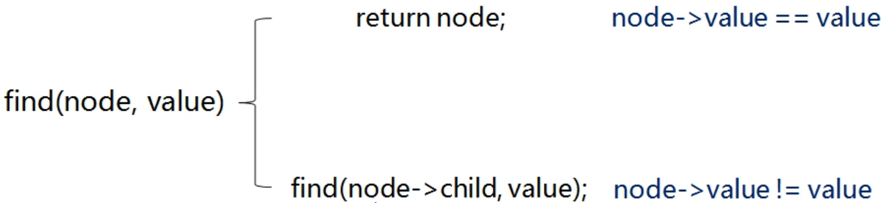

+ **基于结点查找的方案**

  + 功能定义：`find(node, obj)`

  + 在node为根结点的树中查找是否存在 obj 结点

    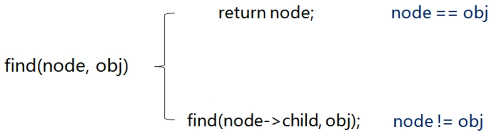

### 2.树中结点的插入操作

+ **插入的方式**

  + 插入新结点

    ```c++
    bool insert(Tree<T>* node)
    ```

  + 插入数据元素

    ```c++
    bool insert(const T&value, TreeNode<T>* parent)
    ```

+ **问题：**

  + 如何指定新结点在树中的位置？

+ **问题分析：**

  + 数是非线性的，无法以下标的形式定位数据元素
  + 每一个树结点都有唯一的前驱结点(父结点)
  + 所以插入时必须先找到前驱结点，然后完成新结点的插入

+ **插入新结点具体流程：**

  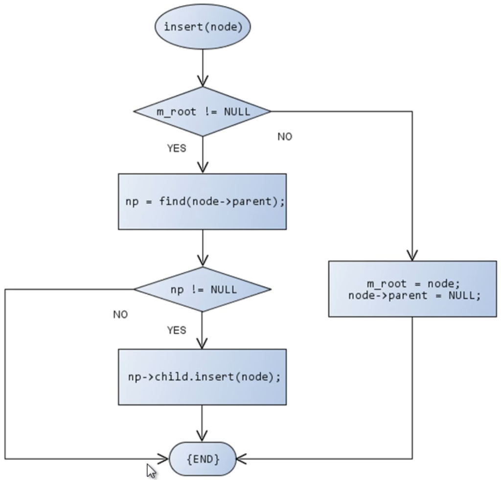

+ **插入数据元素具体流程：**

  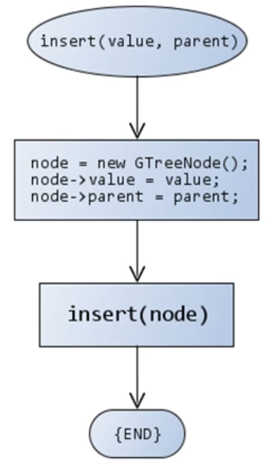

### 3.树中结点的清除操作

+ **树中结点的清除：**

  + `void clear()`
    + 将树中所有结点清除(释放堆中的结点)

+ **将根结点的所有子树清除，然后清除根结点**

  

+ **清除操作功能的定义**

  + free(node)

    + 清除 node 为根结点的树
    + 释放树中每一个结点

    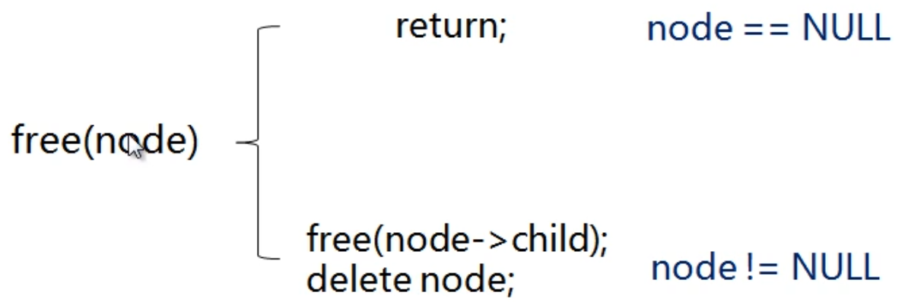

+ **问题：树中的结点可能来自于不同的存储空间，释放方式不同。**
+ **问题分析：**
  + 单凭内存地址很难准确判断具体的存储区域
  + 只有堆空间的内存需要主动释放(delete)
  + 清除操作时只需要对堆中的结点进行释放
+ **解决方案：工厂模式**
  + 在 GTreeNode 中增加保护成员变量 m_flag
  + 将 GTreeNode 中的 operator new 重载为保护成员函数
  + 提供工厂方法 `GTreeNode<T>* NewNode()`
  + 在工厂方法的 new 新结点并将 m_flag 设置为 true

### 4.树中结点的删除操作

+ **删除的方式：**

  + 基于数据元素值的删除

    `SharedPointer<Tree<T>> remove(const T& value)`

  + 基于结点的删除

    `SharedPointer<Tree<T>> remove(TreeNode<T>* node)`

+ **删除操作成员函数的设计要点：**

  + 将被删除结点代表的 **子树进行删除**
  + 删除函数 **返回一棵堆空间中的树**
  + 具体返回值为 **指向树的智能指针对象**

  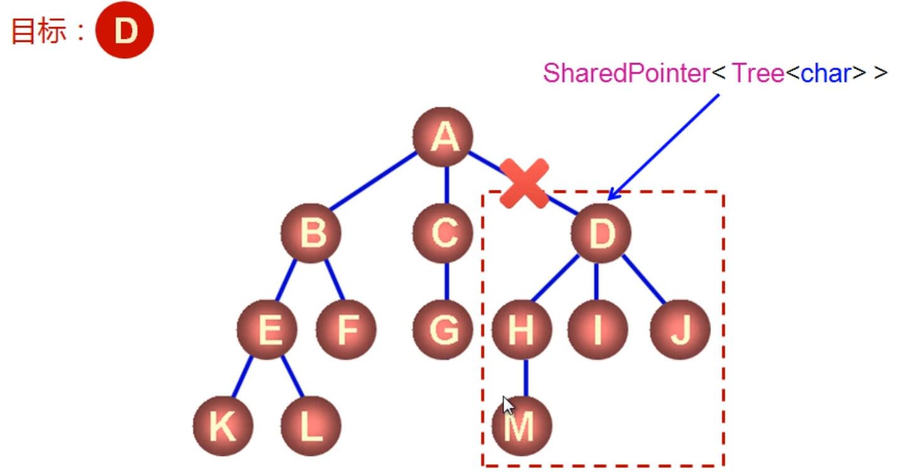

+ **实用的设计原则**

  + 当需要从函数中返回堆中的对象时，使用智能指针作为函数的返回值。

+ **删除操作功能的定义：**

  + `void remove(GTreeNode<T>* node, GTree<T>*& ret)`
    + 将node为根结点的子树从原来的树中删除
    + ret作为子树返回(ret 指向堆空间中的树对象)

+ **删除功能的实现流程：**

  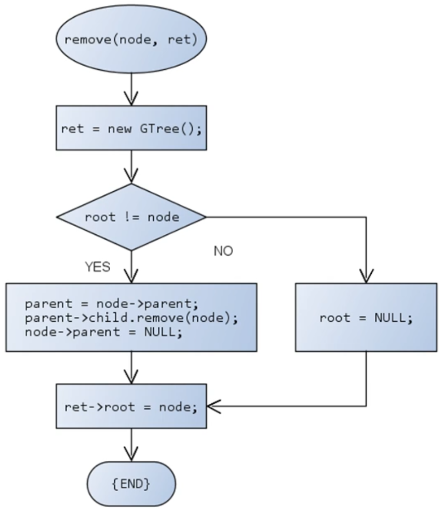

### 5.树中属性操作的实现

+ **树中结点的数目：**

  + 定义功能： `count(node)`

    + 在node为根结点的树中统计结点的数目

    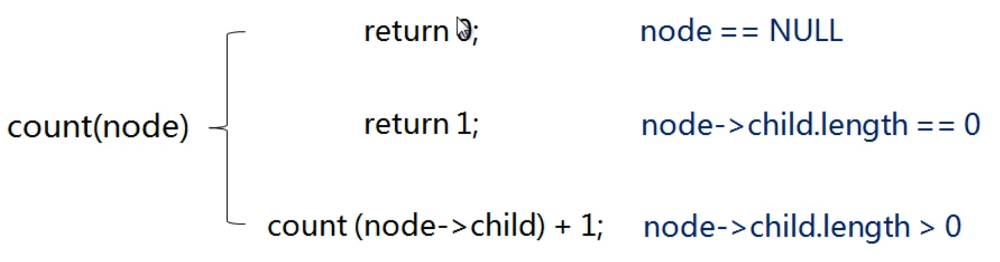

  + 树结点数目的计算示例：

    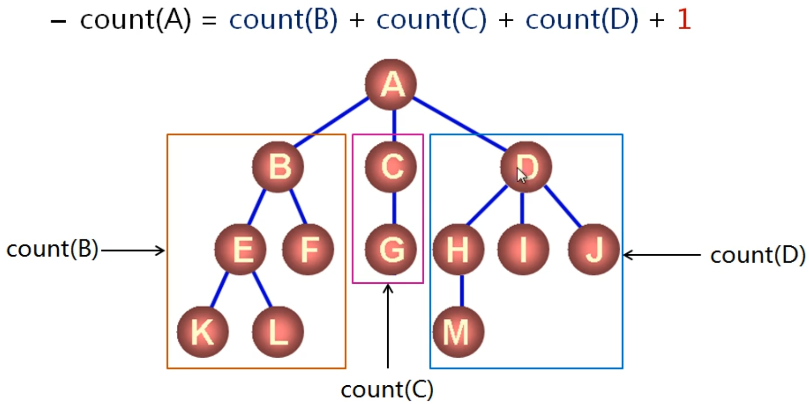

+ **树的高度：**

  + 定义功能：`height(node)`

    + 获取 node 为根结点的树的高度

    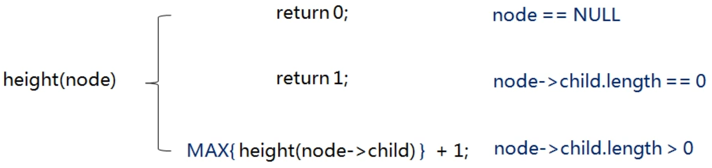

  + 树的高度计算示例：

    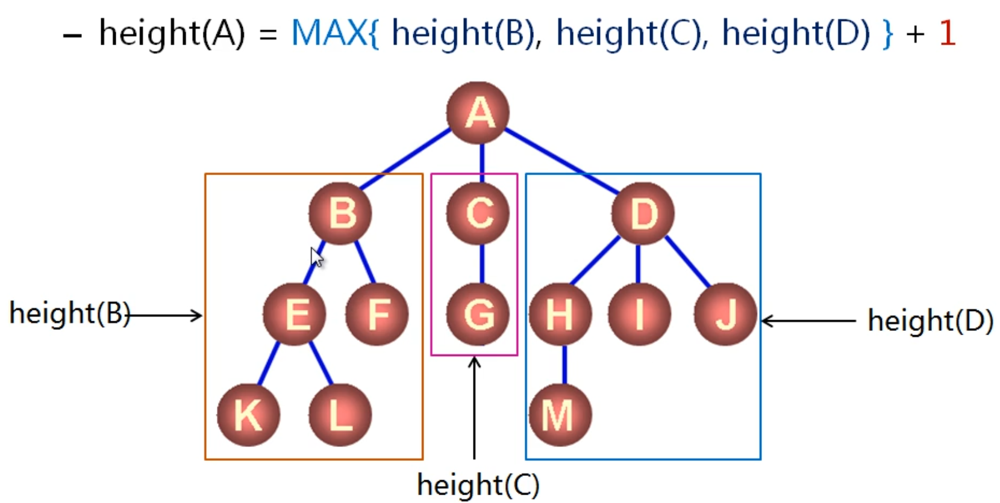

+ **树的度数：**

  + 定义功能：`degree(node)`

    + 获取 node 为根结点的树的度数

    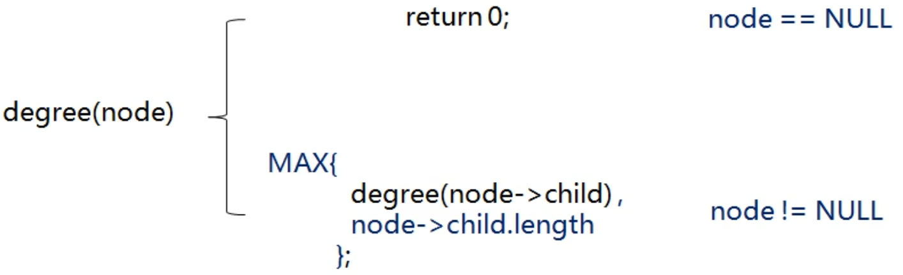