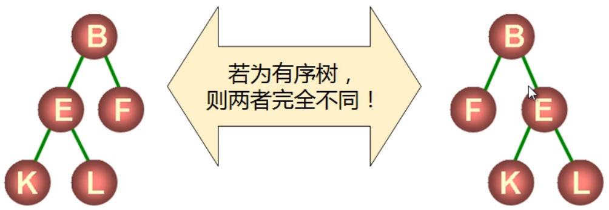
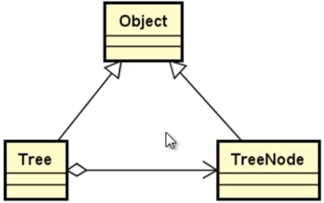
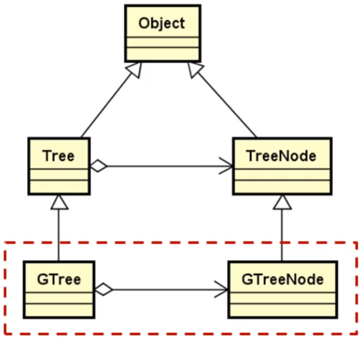
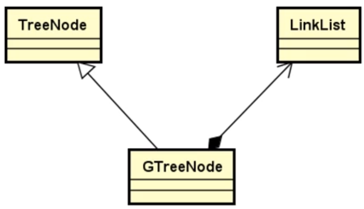
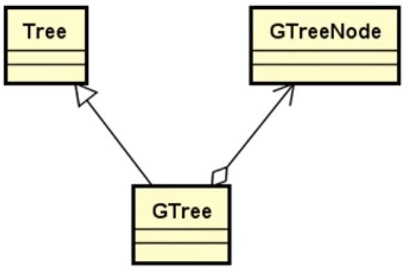
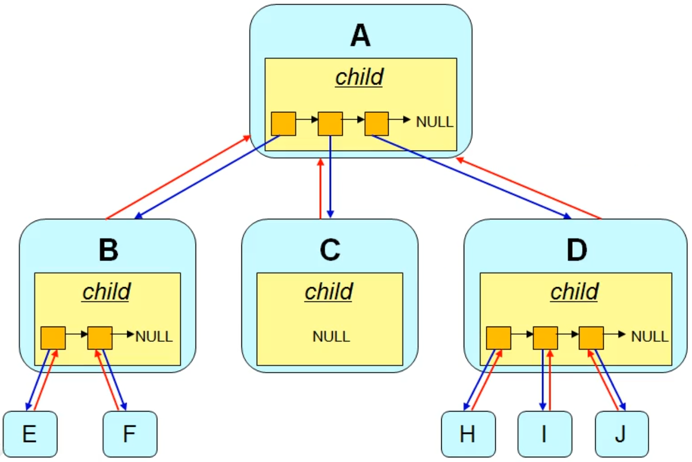

# 树结构

<!-- GFM-TOC -->

* [字符串类的创建](#C++工具准备)

<!-- GFM-TOC -->

## 一.树的定义与操作

### 1.树的定义

+ 树是一种非线性的数据结构
+ **树是由 <font color = red>n(n >= 0)</font> 个结点组成的有限集合**
  + 如果 **<font color = red>n = 0</font>** ,称为空树
  + 如果 **<font color = red>n > 0</font>** ,则：
    + 有一个特定的称之为 **<font color = red>根(root)</font>** 的结点
    + 根节点只有直接后继，但没有直接前驱
    + 除根以外的其他结点划分为 **<font color = red>m(m>=0)</font>** 个互不相交的有限集合 **<font color = red>T0,T1,...,Tm-1</font>** ,每个集合又是一棵树，并且称之为根的 **<font color = red>子树</font>** 。

+ **树中度的概念**
  + 树的结点包含一个数据及若干指向子树的分支
  + 结点拥有的子树数目称为 **结点的度**
    + 度为 0 的结点称为叶结点
    + 度不为 0 的结点称为分支结点
  + 树的度定义为所有结点中度的最大值
+ **树中的前驱与后继**
  + 结点的直接后继称为该结点的孩子，该结点为孩子的双亲
  + 结点的孩子的孩子的...称为该结点的子孙，该结点为子孙的祖先
  + 同一个双亲的孩子之间互称为兄弟
+ **树中结点的层次**
  + 根为第一层
  + 根的孩子为第二层
  + ...
  + **树中结点的最大层次称为树的深度或高度**

+ **树的有序性**

  + 如果树中的结点的各个子树从左向右是有次序的，子树间不能互换位置，则称该树为有序树，否则为无序树。

  

+ **森林的概念**
  
  + 森林是由 n(n >= 0) 棵互不相交的树组成的集合

### 2.树的一些常用操作

+ 常见操作

  + 将元素插入树中
  + 将元素从树中删除
  + 获取树的结点数
  + 获取树的高度
  + 获取树的度
  + 清空树中的元素
  + ...

+ 树和结点的类关系

  

+ 树在程序中表现为一种特殊的数据类型

  ```c++
  template<typename T>
  class Tree : public Object {
  protected:
      TreeNode<T>* m_root;
  public:
      Tree() {
          m_root = nullptr;
      }
      virtual bool insert(TreeNode<T>* node) = 0;
      virtual bool insert(const T& value, TreeNode<T>* parent) = 0;
      virtual SharedPointer<Tree<T>> remove(const T& value) = 0;
      virtual SharedPointer<Tree<T>> remove(TreeNode<T>* node) = 0;
      virtual TreeNode<T>* find(const T& value) const = 0;
      virtual TreeNode<T>* find(TreeNode<T>* node) const = 0;
      virtual TreeNode<T>* root() const = 0;
      virtual int degree() const = 0;
      virtual int count() const = 0;
      virtual int height() const = 0;
      virtual void clear() = 0;
  };
  ```

+ 树中的结点也表现为一种特殊的数据结构

  ```c++
  template <typename T>
  class TreeNode : public Object{
  public:
      T value;
      TreeNode<T>* parent;
  
      TreeNode() {
          parent = nullptr;
      }
      virtual ~TreeNode() = 0;
  };
  ```


---

## 二.树的存储结构与实现

### 1.设计要点

+ Gtree为通用树结构，每个结点可以存在多个后继结点
+ GtreeNode 能够包含任意多指向后继结点的指针
+ 实现树结构的所有操作 (增删改查等)

+ 树和结点的存储结构设计

  

### 2.设计与实现

#### (1).GTreeNode设计

+ **设计框图：**

  

+ **类代码：**

  ```c++
  template<typename T>
  class GTreeNode : public TreeNode<T> {
  public:
      LinkList<GTreeNode<T>*> child;
  };
  ```

#### (2).Gtree设计

+ **设计框图：**

  

+ **类代码：**

  ```c++
  template<typename T>
  class GTree : public Tree<T> {
  public:
      bool insert(TreeNode<T>* node);
      bool insert(const T& value, TreeNode<T>* parent);
      SharedPointer<Tree<T>> remove(const T& value);
      SharedPointer<Tree<T>> remove(TreeNode<T>* node) ;
      TreeNode<T>* find(const T& value) const;
      TreeNode<T>* find(TreeNode<T>* node) const;
      TreeNode<T>* root() const;
      int degree() const;
      int count() const;
      int height() const;
      void clear();
  };
  ```

+ **Gtree的实现架构：**

  

