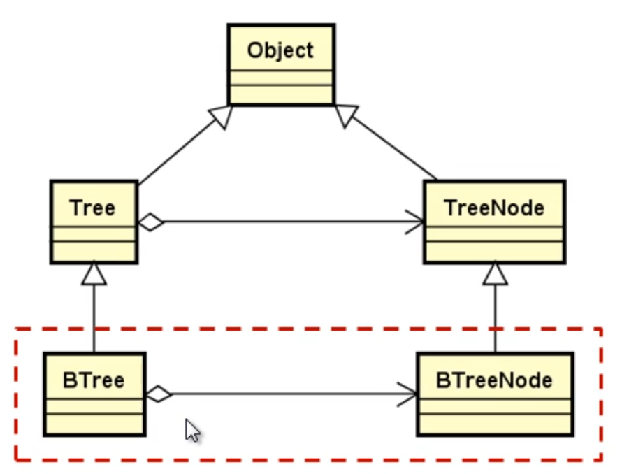
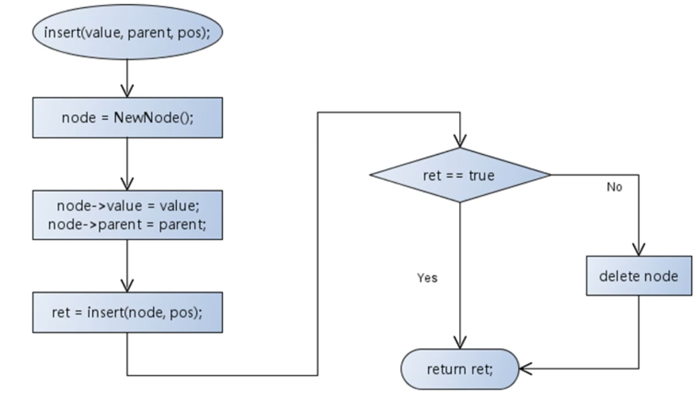

#  树结构

<!-- GFM-TOC -->

* [字符串类的创建](#C++工具准备)

<!-- GFM-TOC -->

## 一.树的定义与操作

### 1.树的定义

+ 树是一种非线性的数据结构

+ **树是由 <font color = red>n(n >= 0)</font> 个结点组成的有限集合**
  + 如果 **<font color = red>n = 0</font>** ,称为空树
  + 如果 **<font color = red>n > 0</font>** ,则：
    + 有一个特定的称之为 **<font color = red>根(root)</font>** 的结点
    + 根节点只有直接后继，但没有直接前驱
    + 除根以外的其他结点划分为 **<font color = red>m(m>=0)</font>** 个互不相交的有限集合 **<font color = red>T0,T1,...,Tm-1</font>** ,每个集合又是一棵树，并且称之为根的 **<font color = red>子树</font>** 。

+ **树中度的概念**
  + 树的结点包含一个数据及若干指向子树的分支
  + 结点拥有的子树数目称为 **结点的度**
    + 度为 0 的结点称为叶结点
    + 度不为 0 的结点称为分支结点
  + 树的度定义为所有结点中度的最大值
  
+ **树中的前驱与后继**
  + 结点的直接后继称为该结点的孩子，该结点为孩子的双亲
  + 结点的孩子的孩子的...称为该结点的子孙，该结点为子孙的祖先
  + 同一个双亲的孩子之间互称为兄弟
  
+ **树中结点的层次**
  
  + 根为第一层
  + 根的孩子为第二层
  + ...
+ **树中结点的最大层次称为树的深度或高度**
  
+ **树的有序性**

  + 如果树中的结点的各个子树从左向右是有次序的，子树间不能互换位置，则称该树为有序树，否则为无序树。

  <div align="center">
      
  </div>

+ **森林的概念**
  
  + 森林是由 n(n >= 0) 棵互不相交的树组成的集合

### 2.树的一些常用操作

+ 常见操作

  + 将元素插入树中
  + 将元素从树中删除
  + 获取树的结点数
  + 获取树的高度
  + 获取树的度
  + 清空树中的元素
  + ...

+ 树和结点的类关系

  <div align="center">
      
  </div>

+ 树在程序中表现为一种特殊的数据类型

  ```c++
  template<typename T>
  class Tree : public Object {
  protected:
      TreeNode<T>* m_root;
  public:
      Tree() {
          m_root = nullptr;
      }
      virtual bool insert(TreeNode<T>* node) = 0;
      virtual bool insert(const T& value, TreeNode<T>* parent) = 0;
      virtual SharedPointer<Tree<T>> remove(const T& value) = 0;
      virtual SharedPointer<Tree<T>> remove(TreeNode<T>* node) = 0;
      virtual TreeNode<T>* find(const T& value) const = 0;
      virtual TreeNode<T>* find(TreeNode<T>* node) const = 0;
      virtual TreeNode<T>* root() const = 0;
      virtual int degree() const = 0;
      virtual int count() const = 0;
      virtual int height() const = 0;
      virtual void clear() = 0;
  };
  ```

+ 树中的结点也表现为一种特殊的数据结构

  ```c++
  template <typename T>
  class TreeNode : public Object{
  public:
      T value;
      TreeNode<T>* parent;
  
      TreeNode() {
          parent = nullptr;
      }
      virtual ~TreeNode() = 0;
  };
  ```


---

## 二.树的存储结构与实现

### 1.设计要点

+ Gtree为通用树结构，每个结点可以存在多个后继结点

+ GtreeNode 能够包含任意多指向后继结点的指针

+ 实现树结构的所有操作 (增删改查等)

+ 树和结点的存储结构设计

  <div align="center">
      
  </div>

### 2.设计与实现

#### (1).GTreeNode设计

+ **设计框图：**

  <div align="center">
      
  </div>

+ **类代码：**

  ```c++
  template<typename T>
  class GTreeNode : public TreeNode<T> {
  public:
      LinkList<GTreeNode<T>*> child;
  };
  ```

#### (2).Gtree设计

+ **设计框图：**

  <div align="center">
      
  </div>

+ **类代码：**

  ```c++
  template<typename T>
  class GTree : public Tree<T> {
  public:
      bool insert(TreeNode<T>* node);
      bool insert(const T& value, TreeNode<T>* parent);
      SharedPointer<Tree<T>> remove(const T& value);
      SharedPointer<Tree<T>> remove(TreeNode<T>* node) ;
      TreeNode<T>* find(const T& value) const;
      TreeNode<T>* find(TreeNode<T>* node) const;
      TreeNode<T>* root() const;
      int degree() const;
      int count() const;
      int height() const;
      void clear();
  };
  ```

+ **Gtree的实现架构：**

  <div align="center">
      
  </div>

## 三.树的操作实现

### 1.树中结点的查找操作

+ **查找的方式**

  + 基于数据元素值的查找

    ```C++
    GTreeNode<T>* find(const T& value) const
    ```

  + 基于结点的查找

    ```c++
    GTreeNode<T>* find(TreeNode<T> T* node) const
    ```

+ **基于数据元素值查找的方案**

  + 定义功能：`find (node, value)`

  + 在node为根结点的树中查找value所在的结点

    <div align="center">
        
    </div>

+ **基于结点查找的方案**

  + 功能定义：`find(node, obj)`

  + 在node为根结点的树中查找是否存在 obj 结点

    <div align="center">
        
    </div>

### 2.树中结点的插入操作

+ **插入的方式**

  + 插入新结点

    ```c++
    bool insert(Tree<T>* node)
    ```

  + 插入数据元素

    ```c++
    bool insert(const T&value, TreeNode<T>* parent)
    ```

+ **问题：**

  + 如何指定新结点在树中的位置？

+ **问题分析：**

  + 数是非线性的，无法以下标的形式定位数据元素
  + 每一个树结点都有唯一的前驱结点(父结点)
  + 所以插入时必须先找到前驱结点，然后完成新结点的插入

+ **插入新结点具体流程：**

  <div align="center">
      
  </div>

+ **插入数据元素具体流程：**

  <div align="center">
      
  </div>

### 3.树中结点的清除操作

+ **树中结点的清除：**

  + `void clear()`
    + 将树中所有结点清除(释放堆中的结点)

+ **将根结点的所有子树清除，然后清除根结点**

  <div align="center">
      
  </div>

+ **清除操作功能的定义**

  + free(node)

    + 清除 node 为根结点的树
    + 释放树中每一个结点

    <div align="center">
        
    </div>

+ **问题：树中的结点可能来自于不同的存储空间，释放方式不同。**

+ **问题分析：**
  + 单凭内存地址很难准确判断具体的存储区域
  + 只有堆空间的内存需要主动释放(delete)
  + 清除操作时只需要对堆中的结点进行释放
  
+ **解决方案：工厂模式**
  + 在 GTreeNode 中增加保护成员变量 m_flag
  + 将 GTreeNode 中的 operator new 重载为保护成员函数
  + 提供工厂方法 `GTreeNode<T>* NewNode()`
  + 在工厂方法的 new 新结点并将 m_flag 设置为 true

### 4.树中结点的删除操作

+ **删除的方式：**

  + 基于数据元素值的删除

    `SharedPointer<Tree<T>> remove(const T& value)`

  + 基于结点的删除

    `SharedPointer<Tree<T>> remove(TreeNode<T>* node)`

+ **删除操作成员函数的设计要点：**

  + 将被删除结点代表的 **子树进行删除**
  + 删除函数 **返回一棵堆空间中的树**
  + 具体返回值为 **指向树的智能指针对象**

  <div align="center">
      
  </div>

+ **实用的设计原则**

  + 当需要从函数中返回堆中的对象时，使用智能指针作为函数的返回值。

+ **删除操作功能的定义：**

  + `void remove(GTreeNode<T>* node, GTree<T>*& ret)`
    + 将node为根结点的子树从原来的树中删除
    + ret作为子树返回(ret 指向堆空间中的树对象)

+ **删除功能的实现流程：**

  <div align="center">
      
  </div>

### 5.树中属性操作的实现

+ **树中结点的数目：**

  + 定义功能： `count(node)`

    + 在node为根结点的树中统计结点的数目

    <div align="center">
        
    </div>

  + 树结点数目的计算示例：

    <div align="center">
        
    </div>

+ **树的高度：**

  + 定义功能：`height(node)`

    + 获取 node 为根结点的树的高度

    <div align="center">
        
    </div>

  + 树的高度计算示例：

    <div align="center">
        
    </div>

+ **树的度数：**

  + 定义功能：`degree(node)`

    + 获取 node 为根结点的树的度数

    <div align="center">
        
    </div>

### 5.树结构的层次遍历

+ 当前事实：
  
  + 树是非线性结构，树的结点没有固定的编号方式
  
+ 新的需求：
  
+ 为通用树结构提供新的方法，快速遍历每一个结点
  
+ **设计思路：**

  + 在树中定义一个游标 `GTreeNode<T>*`
  + 遍历之前将游标指向根结点
  + 获取游标指向的数据元素
  + 通过结点中的child成员移动游标

  <div align="center">
      
  </div>

+ **层次遍历算法：**

  + 原料： `class LinkQueue<T>()`
  
  + 游标：`LinkQueue<T>::front()`
  
  + 思想：
    + `begin()`：将根结点压入队列
    + `current()`：访问队头元素指向的数据元素
  + `next()`：队头元素弹出，将队头元素的孩子压入栈中
  
+ `end()`：判断队列是否为空
  
  + 层次遍历算法实例：
  
    <div align="center">
        
    </div>

## 四.二叉树的定义与性质

### 1.二叉树的定义

+ 二叉树是由 n(n>=0) 个结点组成的有限集合，该集合或者为空，或者是由一个根结点加上两棵分别称为左子树和右子树的，互不相交的二叉树组成。

+ **满二叉树：**如果二叉树中所有分支结点的度数都为2，且 **叶子结点都在同一层次上** ，则称这类二叉树为满二叉树。
+ **完全二叉树：**如果一棵具有n个结点的高度为K的树，它的每一个结点都与高度为K的满二叉树中的编号为 1—n 的节点一一对应，则称这棵树为完全二叉树。(从上到下，从左到右编号)
  + **特性：**
    + 同样结点数二叉树，完全二叉树的高度最小
    + 完全二叉树的叶结点仅出现在最后两层
      + 最底层的叶结点一定出现在左边
      + 倒数第二层的叶结点一定出现在右边
      + 完全二叉树中度为 1 的结点只有左孩子

### 2.二叉树的深层性质

+ 在二叉树的第 i 层最多有 `2^( i-1 )`个结点。
+ 高度为 K 的 二叉树最多有 `2^k - 1` 个结点。
+ 对任何一棵二叉树，如果其叶子结点有 `n0` 个，度为 2 的非叶结点有 `n2` 个，则 `n0 = n2 + 1`
  + 假设叶结点的个数为 `n0`, 度为 1 的结点个数为 `n1`，度为2的结点的个数为 `n2`，所有结点数为`n`，树的边数为`e`
  + 从上往下看，有规律如下：`e = n1 + 2n2`
  + 从下往上看，有规律如下：`e = n - 1 = n1 + n2 +n0 -1`
  + 故`n0 = n2 + 1`
+ 具有 n 个结点的完全二叉树的高度为 (log2^n)向下取整 + 1
  
  + 假设n个结点组成的完全二叉树的高度为k
  + 则 `2^(k-1) -1 < n <= 2^(k) - 1`
  + 因为 n 为整数，所以`2^(k-1) <= n < 2^(k) `
  + 所以 `k - 1 <= log2^n < k`
+ **一棵有n个结点的二叉树(高度为log2^n + 1)，按层次对结点进行编号，对任意结点 i 有：**
  + i = 1，结点 i 为二叉树的根
  + i > 1，则其双亲结点为 i/2(向下取整)
  + 2i <= n，则结点 i 的左孩子为2i 
  + 2i > n，则结点 i 无左孩子
  + 2i + 1 <= n，则结点 i 的右孩子为 2i + 1
  + 2i + 1 > n，则结点 i 无右孩子
  
  > 这一条性质为完全二叉树所特有，普通二叉树不具备

---

## 五.二叉树的存储结构与实现

### 1.设计要点



+ BTree为二叉树结构，每个结点最多只有两个后继结点
+ BTreeNode只包含 4 个固定公有成员：父结点，自身结点，左右子结点
+ 实现树结构的所有操作

### 2.设计与实现

+ BTreeNode 的设计与实现


```c++
template<typename T>
class BTreeNode : TreeNode<T>{
public:
    BTreeNode<T>* left;
    BTreeNode<T* right;
    static BTreeNode<T>* NewNode() {
        BTreeNode<T>* ret = new BTreeNode<T> ();
        if(ret != nullptr) {
            ret->m_flag = true;
        }
        return ret;
    }
};
```


+ Btree的设计与实现

  

  ```c++
  template<typename T>
  class BTree : public Tree<T> {
  public:
      bool insert(TreeNode<T>* node) {
          bool ret = true;
          return ret;
      }
      bool insert(const T& value, TreeNode<T>* parent) {
          bool ret = true;
          return ret;
      }
      SharedPointer<Tree<T>> remove(const T& value) {
          return nullptr;
      }
      SharedPointer<Tree<T>> remove(TreeNode<T>* node)  {
          return nullptr;
      }
      BTreeNode<T>* find(const T& value) const  {
          return nullptr;
      }
      BTreeNode<T>* find(TreeNode<T>* node) const  {
          return nullptr;
      }
      BTreeNode<T>* root() const  {
          return dynamic_cast<BTreeNode<T>*>(this->m_root);
      }
      int degree() const {
          return 0;
      }
      int count() const {
          return 0;
      }
      int height() const {
          return 0;
      }
      void clear() {
          this->m_root = nullptr;
      }
      ~BTree() {
          clear();
      }
  };
  ```

  

+ BTree的实现架构

  

---

## 六. 二叉树的操作实现

### 1.二叉树中结点的查找操作

+ **查找的方式：**

  + 基于数据元素值的查找

    ```c
    BTreeNode<T>* find(const T& value) const
    ```

  + 基于结点的查找

    ```c++
    BTreeNode<T>* find(TreeNode<T> T* node) const
    ```

+ **基于数据元素值查找的方案**

  + 定义功能：`find (node, value)`

  + 在node为根结点的二叉树中查找value所在的结点

    

+ **基于结点查找的方案**

  + 功能定义：`find(node, obj)`

  + 在node为根结点的树中查找是否存在 obj 结点

    

### 2.二叉树中结点的插入操作

+ **注意事项：**

  + 在二叉树中不能在任意结点处插入子结点
  + 需要指定新结点的插入位置

+  **设置二叉树结点的位置枚举类型**

  ```c++
  enum BTNodePos {
  	ANY,
  	LEFT,
  	RIGHT
  }
  ```

+ **插入的方式：**

  + 插入新结点

    ```c++
    bool insert(TreeNode<T>* node)
    ```

    ```c++
    bool insert(TreeNode<T>* node, BTNodePos pos)
    ```

  + 插入数据元素

    ```c++
    bool insert(const T&value, TreeNode<T>* parent)
    ```

    ```c++
    bool insert(const T&value, TreeNode<T>* parent, BTNodePos pos)
    ```

+ **插入流程：**

  + 插入新结点

    

  + 插入新数据元素

    

### 3.二叉树中结点的删除与清除

+ **删除的方式：**

  + 基于数据元素值的删除

    `SharedPointer<Tree<T>> remove(const T& value)`

  + 基于结点的删除

    `SharedPointer<Tree<T>> remove(TreeNode<T>* node)`

+ **删除操作功能的定义：**

  + `void remove(BTreeNode<T>* node, BTree<T>*& ret)`
    + 将node为根结点的子树从原来的二叉树中删除
    + ret作为子树返回(ret 指向堆空间中的二叉树对象)

+ 删除功能函数的实现

  

+ **二叉树中结点的清除：**

  + `void clear()`
    + 将二叉树中所有结点清除(释放堆中的结点)

+ **清楚操作功能的定义：**

  + 清除 node 为根结点的二叉树
  + 释放二叉树中的每一个结点

  


### 4.二叉树中属性操作的实现

+ **二插树中结点的数目：**

  + 定义功能： `count(node)`

    + 在node为根结点的树中统计结点的数目

      

+ **二插树的高度：**

  + 定义功能：`height(node)`

    + 获取 node 为根结点的树的高度

      

+ **二插树的度数：**

  + 定义功能：`degree(node)`

    + 获取 node 为根结点的树的度数

      

### 5.二叉树的层次遍历

+ **设计思路：**

  + 提供一组遍历相关的函数，按层次访问二叉树中的数据元素。

    

+ **层次遍历算法：**
  + 原料： `class LinkQueue<T>()`

  + 游标：`LinkQueue<T>::front()`

  + 思想：
    + `begin()`：将根结点压入队列
    + `current()`：访问队头元素指向的数据元素
    + `next()`：队头元素弹出，将队头元素的孩子压入栈中
    + `end()`：判断队列是否为空


### 6.二叉树的先序遍历

+ 遍历流程：
  + 二叉树为空
    + 无操作，直接返回
  + 二叉树不为空
    + 访问根结点中的数据元素
    + 访问左子树
    + 访问右子树


+ 代码实现

  ```c++
  void preOrderTraversal(BTreeNode<T>* node) {
    	if(node != nullptr) {
      std::cout << node->value << " ";
      preOrderTraversal(node->left);
      preOrderTraversal(node->right);
    }
  }
  ```


### 7.二叉树的中序遍历

+ 遍历流程：

  + 二叉树为空
    + 无操作，直接返回
  + 二叉树不为空
    + 访问左子树
    + 访问根结点中的数据元素
    + 访问右子树

  

+ 代码实现

  ```c++
  void inOrderTraversal(BTreeNode<T>* node) {
    if(node != nullptr) {
      inOrderTraversal(node->left);
      std::cout << node->value << " ";
      inOrderTraversal(node->right);
    }
  }
  ```

  

### 8.二叉树的后序遍历

+ 遍历流程：

  + 二叉树为空
    + 无操作，直接返回
  + 二叉树不为空
    + 访问左子树
    + 访问右子树
    + 访问根结点中的数据元素

  


+ 代码实现：

  ```c++
  void postOrderTraversal(BTreeNode<T>* node) {
    if(node != nullptr) {
      postOrderTraversal(node->left);
      postOrderTraversal(node->right);
      std::cout << node->value << " ";
    }
  }
  ```

  

